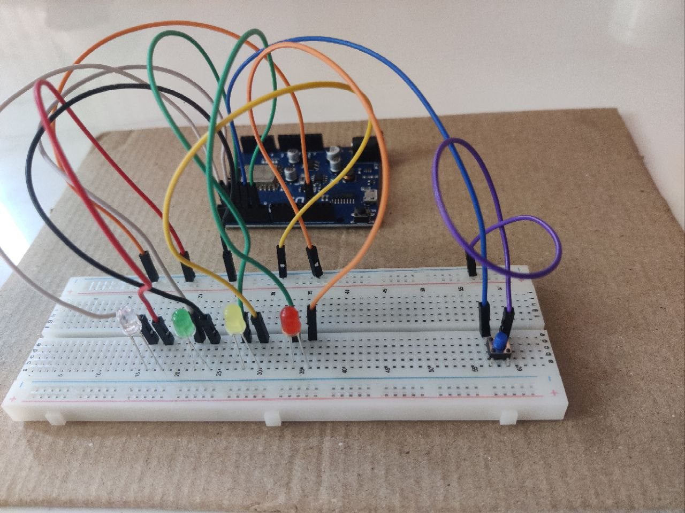

# ESP8266 LED Interfacing with Button 💡🔘

This project demonstrates interfacing LEDs with a push button using an ESP8266 (D1 R1). The LEDs are connected to pins D1, D2, D3, and D5, while the push button is connected to pin D4 for changing LED lighting modes.

 

 

                                   _____________________
                                  |          |          |
                                  |    D1    |    D2    |
                                  |__________|__________|
                                  |          |          |
                                  |    D3    |    D5    |
                                  |__________|__________|            _______
                                  |          |          |           |       |
                                  |    D4    |    GND   |---------- |  GND  |
                                  |__________|__________|           |_______|

- D1, D2, D3, D5: Pins connected to LEDs.
- D4: Pin connected to the push button.
- GND: Ground connection.

## Setup Steps 🛠️

Follow these steps to set up the circuit:

### 1. Circuit Connection

Connect the components as follows:

- Connect LEDs (3.3V Red, Green, Blue, Yellow LEDs) to pins D1, D2, D3, and D5 on the ESP8266 board.
- Connect the push button to pin D4 on the ESP8266 board.
- Connect the negative (shorter) lead of each LED to the ground (GND) on the breadboard to complete the circuit.

For detailed connections and pinouts, refer to the component directories in the `components` folder.

### 2. Components Required 🧰

You will need the following components:

- **Wemos ESP8266 Wi-Fi Board (D1 R1)**: Microcontroller board.
  - **Specifications**:
    - Microcontroller: ESP8266 (D1 R1)
    - Clock Speed: 80MHz (up to 160MHz)
    - USB Converter: CH340G
    - Operating Voltage: 3.3V
    - Flash Memory: 4MB
    - Digital I/O: 11
    - Analog Inputs: 1
    - Communications: I2C, Serial, SPI
    - WiFi: Built-in
- **LEDs**: For lighting effects.
  - **Specifications**:
    - Type: 3.3V LEDs (Red, Green, Blue, Yellow)
- **Push Button**: For mode switching.
- **Male to Male Jumper Wires**: For connecting components.

## Connecting LEDs on Breadboard 🍞💡

To connect LEDs on a breadboard, follow these steps:

1. Insert the LEDs into the breadboard, ensuring the longer lead (positive) is on one side and the shorter lead (negative) is on the other side.
2. Connect the positive (longer) lead of each LED to a digital pin on the ESP8266 board (D1, D2, D3, D5).
3. Connect the negative (shorter) lead of each LED to the ground (GND) on the ESP8266 board.
     

For detailed specifications and connection diagrams of LEDs, refer to the LED component directory in the `components` folder.

## Components 🧩

### Wemos ESP8266 Wi-Fi Board (D1 R1) 💡

This directory contains information about the ESP8266 microcontroller board.

#### Specifications

- Microcontroller: ESP8266 (D1 R1)
- Clock Speed: 80MHz (up to 160MHz)
- USB Converter: CH340G
- Operating Voltage: 3.3V
- Flash Memory: 4MB
- Digital I/O: 11
- Analog Inputs: 1
- Communications: I2C, Serial, SPI
- WiFi: Built-in

For more details, refer to [Wemos ESP8266 Wi-Fi Board (D1 R1) Details](components/ESP8266)

### LED 💡

This directory contains information about the LEDs used in the project.

#### Specifications

- Type: 3.3V LEDs (Red, Green, Blue, Yellow)

For more details, refer to [LED Details](components/LED)

### Push Button 🔘

This directory contains information about the push button used in the project.

For more details, refer to [Push Button Details](components/PUSH_BUTTON)

### Male to Male Jumper Wires 🚀

This directory contains information about the male to male jumper wires used in the project.

For more details, refer to [Jump Wires Details](components/JUMP_WIRE)

### Breadboard 🍞

This directory contains information about the breadboard used in the project.

#### Specifications

- Type: Full-size Breadboard
- Total Holes: 830
- Spacing: 2.54mm (0.1")
- Dimension: 16.5x5.5cm
- Common Rating: 1A @ 5V or 5 Watt

For more details, refer to [Breadboard Details](components/BREAD_BOARD)

## Code 💻

### Arduino Software

Before uploading the code to the ESP8266 board, make sure you have the Arduino software installed. You can download it from the [Arduino website](https://www.arduino.cc/en/software).

### Uploading Code

1. Open the Arduino software.
2. Connect your ESP8266 board to your computer using a USB cable.
3. Select the correct board and port from the **Tools** menu.
4. Open the Arduino code file [`LED_Button_Interfacing.ino`](code/LED_Button_Interfacing/LED_Button_Interfacing.ino) from this repository.
5. Click the **Upload** button to compile and upload the code to your ESP8266 board.

Make sure your code is properly commented and formatted for better understanding.

The Arduino code for this project can be found [here](code/LED_Button_Interfacing/LED_Button_Interfacing.ino).

Make sure your code is properly commented and formatted for better understanding.

## Screenshots 📸

## License 📝

This repository is open-source and is licensed under the [MIT License](LICENSE.md). Feel free to use, modify, and share these programs as you see fit. Refer to the LICENSE file for full details.

_Disclaimer: The code provided in this repository is for educational purposes. While efforts have been made to ensure correctness, it may not be suitable for production use. Use the code at your own risk._
