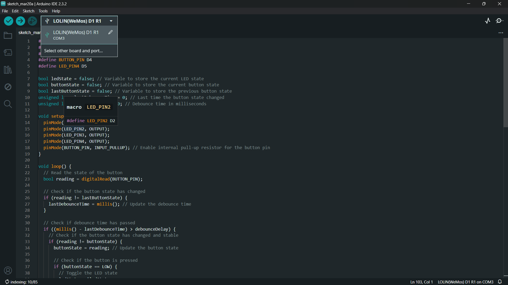
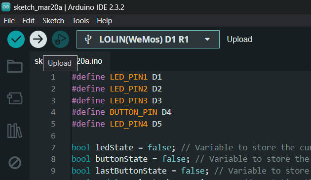
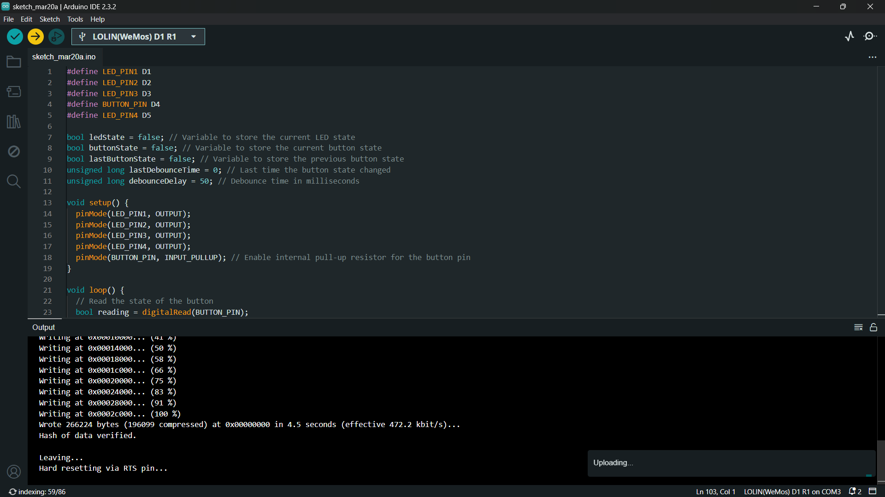

# Arduino Code Setup 💻

This guide provides step-by-step instructions for setting up and uploading the Arduino code for the ESP8266 LED Interfacing with Button project.

## Step 1: Install Arduino Software

1. Download and install the [Arduino IDE](https://www.arduino.cc/en/Main/Software) from the official Arduino website.

2. Follow the installation instructions provided for your operating system.

## Step 2: Add ESP8266 Board to Arduino IDE

1. Open the Arduino IDE.

2. Go to `File` > `Preferences`.

3. In the `Additional Board Manager URLs` field, add the following URL:   `http://arduino.esp8266.com/stable/package_esp8266com_index.json`

4. Click `OK` to close the Preferences window.

5. Go to `Tools` > `Board` > `Boards Manager...`.

6. Search for `esp8266` and install the `esp8266` board package by ESP8266 Community.

## Step 3: Select ESP8266 Board and Port

1. Connect your ESP8266 board to your computer via USB.

2. Go to `Tools` > `Board` and select `LOLIN(WeMos) D1 R1` as the board.

3. Go to `Tools` > `Port` and select the port to which your ESP8266 board is connected.

## Step 4: Open and Upload Code

1. Open the Arduino code file (`LED_Button_Interfacing.ino`) in the Arduino IDE.

2. Verify and compile the code by clicking the checkmark icon (Verify) in the upper left corner of the Arduino IDE.

3. Once the code is compiled without errors, upload it to the ESP8266 board by clicking the right arrow icon (Upload) next to the Verify button.

4. Wait for the upload process to complete.

## Step 5: Verify Output

1. After uploading the code, open the serial monitor by clicking `Tools` > `Serial Monitor`.

2. Set the baud rate to `115200`.

3. Press the push button connected to pin D4 to toggle between LED lighting modes.

## Screenshots 📸

### Board Selection

### Upload Code

### Final Output

