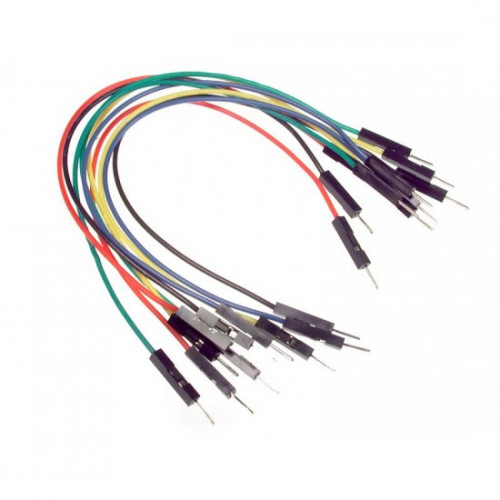

# Male to Male Jumper Wires 🚀

This directory contains information about the male to male jumper wires used in the project.

## Specifications

- **Type**: Male to Male Jumper Wires
- **Length**: [Insert length]
- **Connector Type**: [Insert connector type]

## Description

Male to male jumper wires are used to connect components on a breadboard or between different modules. They provide a flexible and convenient way to make connections in electronic projects.

### Where to Buy

You can purchase male to male jumper wires from online stores like:

For more details and to purchase, visit [Jumper Wires on Amazon](https://www.amazon.com/s?k=male+to+male+jumper+wires).
