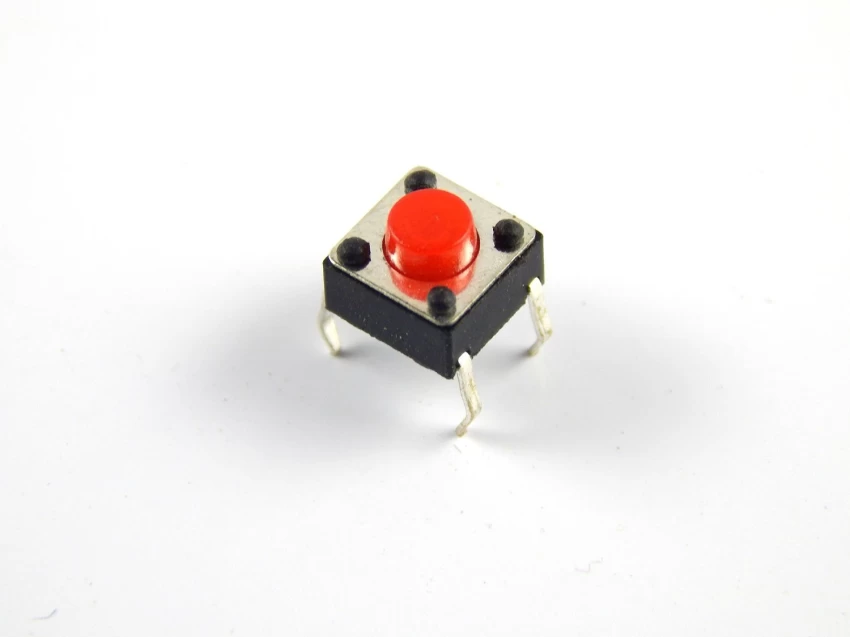

# Push Button 🔘

This directory contains information about the push button used in the project.

## Specifications

- **Type**: Momentary Push Button
- **Rating**: 12V 50mA

## Description

The push button is used for mode switching in the project. It's a momentary switch that returns to its default position when released.

### Where to Buy

You can purchase momentary push buttons from online stores like:

For more details and to purchase, visit [Push Button on Amazon](https://www.amazon.com/s?k=momentary+push+button).
